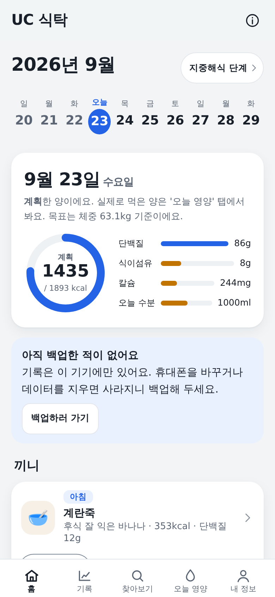
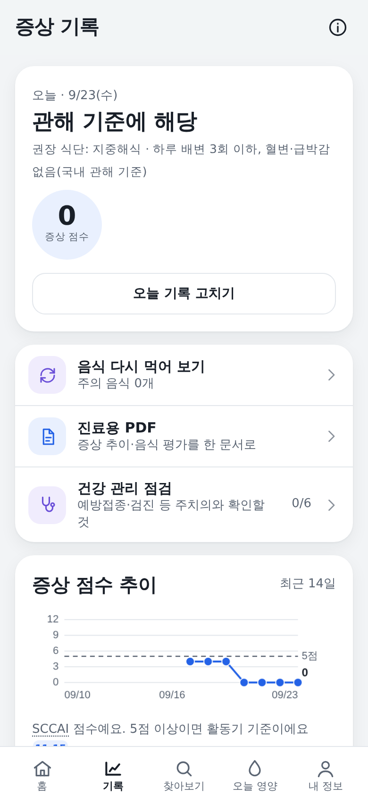
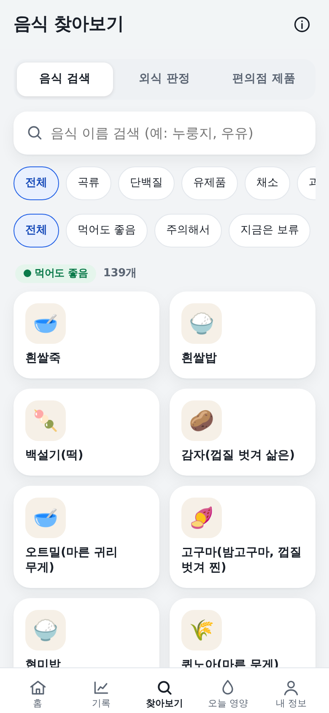
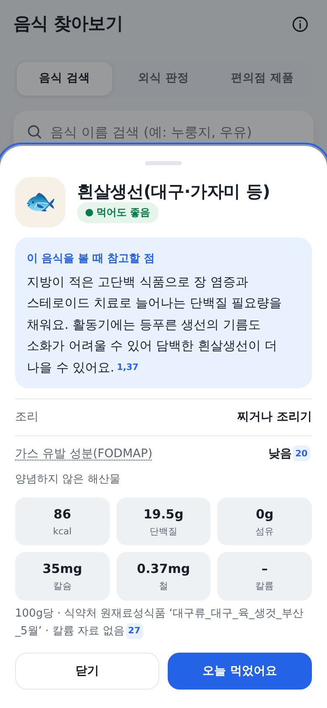

# UC 식탁

궤양성 대장염(ulcerative colitis) 환자가 **오늘 무엇을 먹어도 되는지**를
증상 기록과 진료지침에 맞춰 알려 주는 모바일 웹앱입니다.

프레임워크 없이 HTML 한 파일로 만들었고, 설치하면 인터넷 없이도 씁니다.
기록은 서버로 보내지 않고 기기 안에만 남습니다.

**데모:** https://USERNAME.github.io/uc-table/ &nbsp;·&nbsp; **오프라인 설치:** 데모 접속 → 브라우저 메뉴 → 홈 화면에 추가

<!-- USERNAME을 본인 깃허브 아이디로 바꾸세요 -->

| 홈(오늘 식단) | 증상 기록 | 음식 찾아보기 | 음식 상세 |
|---|---|---|---|
|  |  |  |  |

어두운 화면도 지원합니다: [홈](docs/screenshots/home-dark.png) · [상세](docs/screenshots/detail-dark.png)

## 왜 만들었나

궤양성 대장염은 같은 음식이라도 **활동기냐 관해기냐에 따라 먹어도 되는지가 달라집니다.**
환자용 자료는 "기름진 음식을 피하세요" 같은 문장으로 끝나는 경우가 많아,
실제 식탁 앞에서는 매번 다시 검색하게 됩니다.

이 앱은 그 판단을 세 가지로 나눠 자동화했습니다.
증상 기록으로 **지금의 단계**를 정하고, 음식마다 **그 단계에서의 판정**을 미리 계산해 두고,
판정마다 **어떤 지침의 어느 대목에서 나왔는지**를 번호로 붙여 확인할 수 있게 했습니다.

## 기능

- **증상 기록** — 배변·혈변·급박감·통증을 단계별 마법사로 기록하고 SCCAI 점수와 추이를 봅니다.
- **단계 자동 판정** — 점수에 따라 저잔사식 / 이행식 / 지중해식 중 현재 단계를 고릅니다.
- **오늘 식단 제안** — 단계·알레르기·의료진 지시·싫어하는 음식을 모두 통과한 세 끼를 제안합니다.
- **음식 찾아보기** — 439종을 이름·초성·자모로 검색해 판정과 그 이유, 식약처 영양값을 봅니다.
- **외식 판정** — 메뉴 이름과 재료를 적으면 앱 규칙으로 먹어도 되는지 판단합니다.
- **오늘 영양** — 먹은 음식을 더해 열량·단백질·섬유·칼슘·수분을 목표치와 비교합니다.
- **진료용 PDF** — 최근 기록을 표로 정리해 진료 때 보여 줄 수 있는 문서로 내보냅니다.
- **백업·복원** — 파일로 내보내고 다른 기기에서 불러옵니다.

## 기술적으로 신경 쓴 점

**모든 판정에 근거를 붙였습니다.** 화면의 위첨자 번호는 46건의 지침·논문 목록과 1:1로 이어집니다
(ESPEN 2023, AGA 2024, IOIBD 2020, Monash FODMAP, 병원 저잔사식 안내 등 — [목록](docs/evidence.md)).
근거를 못 찾은 규칙은 넣지 않았고, 원문을 읽지 못한 자료 2건은 문서에 그대로 밝혀 두었습니다.

**음식 데이터를 손으로 적지 않았습니다.** 439종의 영양값은 식품의약품안전처 통합식품영양성분DB에서
이름으로 행을 찾아 붙이고, 같은 이름이 여러 계열에 있을 때의 우선순위와 예외를 코드로 고정했습니다.
`python3 src/data/build_app.py`를 돌리면 배포본과 바이트 단위로 같은 파일이 다시 만들어집니다.

**오프라인에서 먼저 동작합니다.** 빌드 스크립트가 PDF 라이브러리를 인라인하고 외부 글꼴 링크를 지워,
오프라인 빌드의 네트워크 요청은 0건입니다. 서비스 워커로 캐시해 비행기 모드에서도 열립니다.

**실제 사용 환경을 테스트했습니다.** Playwright로 40개 파일을 돌려 한글 IME 조합 입력,
키보드가 올라온 좁은 화면, 320 px 화면, 큰 글자 설정, 다크 모드, 사용자 입력의 HTML 주입,
확정 전 입력 보존을 확인합니다([점검 문서](docs/testing.md)).

**기록을 기기 밖으로 내보내지 않습니다.** 서버도 계정도 분석 스크립트도 없고,
저장은 localStorage 한 곳입니다. 저장이 막히면(사생활 모드·용량 초과) 지우기 전에 먼저 백업을 권합니다.
AI 기능은 동의한 뒤에만, 필요한 값만 보냅니다.

## 실행

```bash
git clone https://github.com/USERNAME/uc-table.git
cd uc-table
npm run serve          # http://localhost:8080 에서 오프라인 빌드 실행
```

`src/app/index.html`을 브라우저로 바로 열어도 동작합니다.

### 다시 빌드하기

```bash
python3 src/data/build_app.py      # 음식 데이터·규칙을 앱 소스에 주입
python3 tools/build_offline.py     # public/ 과 dist/ 오프라인 빌드 생성
```

식약처 원본 CSV를 `data/mfds/`에 두면 `python3 src/data/generate_dataset.py`로
영양 데이터부터 다시 만들 수 있습니다([받는 법](docs/data-sources.md)).

### 점검

```bash
npm install && npx playwright install --with-deps chromium
npm test                           # 40개 파일, 약 3분
```

## 저장소 구조

```
src/app/      앱 원본(index.html)과 데이터 주입 전 기준 파일(app.base.html)
src/data/     음식 정의(spec1~6) · 설명 템플릿 · 생성/주입 스크립트
public/       GitHub Pages로 배포하는 오프라인 PWA
tests/        Playwright 점검 40개 (regression 25 · checks 15)
tools/        오프라인 빌드 · 아이콘 · 스크린샷 스크립트
docs/         구조 · 점검 · 데이터 출처 · 근거 목록
vendor/       인라인하는 오픈소스(html2canvas, jsPDF)와 라이선스
```

## 한계

- 의료기기가 아니며 진단·처방을 대신하지 않습니다. [의료 관련 고지](DISCLAIMER.md)를 먼저 읽어 주세요.
- 판정은 공개 지침의 일반 권고를 옮긴 것이라, 개인의 침범 범위·수술력·동반 질환을 반영하지 않습니다.
- 영양값은 대표값이므로 실제 조리법·분량에 따라 달라집니다.
- 실제 환자를 대상으로 한 사용성 검증이나 임상 평가는 하지 않았습니다.
- 안드로이드 크롬을 기준으로 만들었고, iOS 사파리에서는 확인하지 않았습니다.

## 만든 과정

> 설계·구현·검토에 AI 도구(Claude)를 활용했습니다. 규칙과 근거 자료는 원문을 확인해 확정했습니다.
> (이 문단은 필요에 맞게 고치거나 지우세요.)

## 라이선스

코드는 [MIT 라이선스](LICENSE)입니다.
영양 데이터는 식품의약품안전처 공개 데이터를 이용했으며 출처 표시를 유지해야 합니다.
포함된 오픈소스의 라이선스는 [데이터 출처 문서](docs/data-sources.md)에 정리했습니다.
